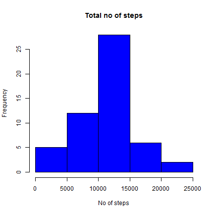
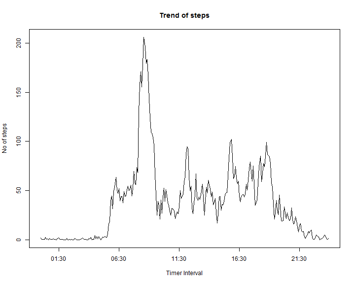
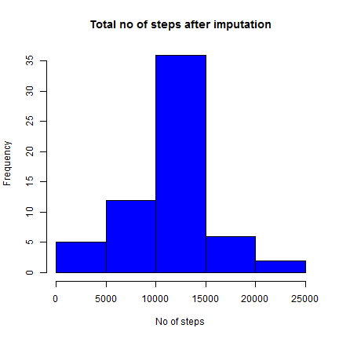
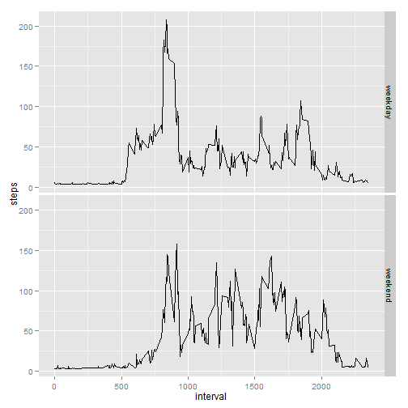

Reproduciable Research - Peer Assignment 1
========================================================
## Loading and preprocessing the data


```r
x <- read.csv("activity.csv")
y <- complete.cases(x)
w <- x[y, ]
```


##  Total number of steps taken per day


```r
z <- aggregate(steps ~ date, w, sum)
hist(z$steps, main = "Total no of steps", xlab = "No of steps", col = "blue")
```

 

### Mean of total steps

```r
mean(z$steps)
```

```
## [1] 10766
```

### Median of total steps

```r
median(z$steps)
```

```
## [1] 10765
```

## Average daily activity pattern


```r
temp <- aggregate(steps ~ interval, w, mean)
temp$interval <- strptime(sprintf("%04d", as.numeric(as.character(temp$interval))), 
    "%H%M")
plot(temp$interval, temp$steps, type = "l", main = "Trend of steps", xlab = "Timer Interval", 
    ylab = "No of steps")
```

 


### 5-minute interval contains the maximum number of steps


```r
temp[(temp$steps == max(temp$steps)), ]
```

```
##                interval steps
## 104 2014-07-20 08:35:00 206.2
```

## Imputing missing values

### Total number of missing values in the dataset 

```r
table(y)
```

```
## y
## FALSE  TRUE 
##  2304 15264
```


###  Filling in all of the missing values & creation of new dataset.

```r
library(rrcovNA)
```

```
## Warning: package 'rrcovNA' was built under R version 3.1.1
```

```
## Loading required package: rrcov
```

```
## Warning: package 'rrcov' was built under R version 3.1.1
```

```
## Loading required package: robustbase
```

```
## Warning: package 'robustbase' was built under R version 3.1.1
```

```
## Loading required package: pcaPP
```

```
## Warning: package 'pcaPP' was built under R version 3.1.1
```

```
## Loading required package: mvtnorm
```

```
## Warning: package 'mvtnorm' was built under R version 3.1.1
```

```
## Scalable Robust Estimators with High Breakdown Point (version 1.3-4)
## 
## Scalable Robust Estimators with High Breakdown Point for
## Incomplete Data (version 0.4-4)
```

```r
xx <- as.data.frame(impSeq(x))
```


### Histogram of the total number of steps taken each day 

```r
zz <- aggregate(steps ~ date, xx, sum)
hist(zz$steps, main = "Total no of steps after imputation", xlab = "No of steps", 
    col = "blue")
```

 


### Mean of total steps

```r
mean(zz$steps)
```

```
## [1] 10767
```

### Median of total steps

```r
median(zz$steps)
```

```
## [1] 10781
```


## Activity patterns between weekdays and weekends

### New data set with week levels


```r
xxx <- x
xxx$steps <- xx$steps
xxx$date <- as.Date(xxx$date)
xxx$week <- as.factor(weekdays(xxx$date))
library(plyr)
library(ggplot2)
xxx$week <- mapvalues(xxx$week, from = c("Friday", "Monday", "Thursday", "Tuesday", 
    "Wednesday", "Sunday", "Saturday"), to = c("weekday", "weekday", "weekday", 
    "weekday", "weekday", "weekend", "weekend"))
```


### Plot of activity pattern in weekday & weekend


```r
df <- aggregate(steps ~ interval + week, xxx, mean)
ggplot(df, aes(interval, steps)) + geom_line() + facet_grid(week ~ .)
```

 

